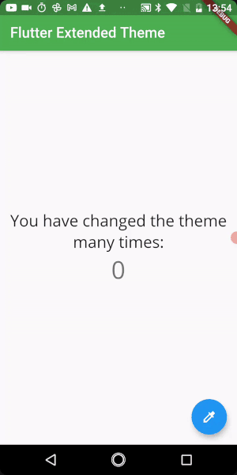

# extended_theme

Easy management of themes for Flutter apps. Create theme sets, extend standard themes, update themes in runtime.
Define your theme classes or use Material and Cupertino themes out the box! 



## Usage

### Using predefined themes (skins)
1. Define your theme class that extends `ExtendedTheme` (Optional, bacause you may to use class `ExtendedTheme` out the box) Do not forget call super constructor and pass them `material` or `cupertino` theme data.
```dart
class AppTheme extends ExtendedTheme {
  final double centerFontSize;
  final Color shadowColor;
  final Color buttonPauseColor;
  final Color subtitleColor;
  
  AppTheme(ThemeData material, this.centerFontSize,
      {this.shadowColor, this.buttonPauseColor, this.subtitleColor})
      : super(material: material);
}

```
2. Define themes configuration (skins)
```dart

const MagentaLight = 'MagentaLight';
const MagentaDark = 'MagentaDark';
const GreenLight = 'GreenLight';
const GreenDark = 'GreenDark';
const BlueLight = 'BlueLight';
const BlueDark = 'BlueDark';

final appThemes = {
  MagentaLight:
      AppTheme(ThemeData.light(), 28, subtitleColor: const Color(0xff8e8e8e)),
  MagentaDark:
      AppTheme(ThemeData.dark(), 14, subtitleColor: const Color(0xffA5A5A5)),
  GreenLight:
      AppTheme(ThemeData.light(), 22, subtitleColor: const Color(0xff8e8e8e)),
  GreenDark:
      AppTheme(ThemeData.dark(), 12, subtitleColor: const Color(0xffA5A5A5)),
  BlueLight: AppTheme(
    ThemeData.light(),
    14,
    subtitleColor: const Color(0xff8e8e8e),
  ),
  BlueDark: AppTheme(
      ThemeData.dark().copyWith(primaryColor: Colors.blue[700]), 10,
      subtitleColor: const Color(0xffA5A5A5))
};

```

3. Wrap your root widget in `ThemeScope` widget and link material theme with needed property of material app. Do not forget to use `themeBuilder`
```dart
class MyApp extends StatelessWidget {
  // Read this value from SharedPrefs for example
  final String initialTheme;

  const MyApp({Key key, this.initialTheme}) : super(key: key);

  @override
  Widget build(BuildContext context) {
    return ThemeScope<AppTheme>(
      themeId: initialTheme,
      // Skins that your defined on previous step
      availableThemes: appThemes,
      themeBuilder: (context, appTheme) {
        return MaterialApp(
          title: 'Flutter Demo',
          // Set material Theme Data
          theme: appTheme.material,
          home: MyHomePage(title: 'Flutter Extended Theme'),
        );
      },
    );
  }
}

```
4. Getting theme properties in your widget tree. By `ThemeHolder`:
```dart
ThemeHolder.themeOf<AppTheme>(context).centerFontSize

```
Or by `Theme` (if you use material app and no need access to additional properties):
```dart
Theme.of(context).textTheme.headline4

```

5. Update theme (skin):
```dart
ThemeHolder.of<AppTheme>(context)
              .updateThemeById('MagentaDark');

```


### Build themes in runtime
Sometimes the use of predefined themes imposes a limitation. For example, if you want to keep the users selected font separately. This is done by building the themes in the runtime.

1. Define your class extends `ExtendedTheme` (Optional, performed in the same way as in the previous section) 
2. Build your initial theme and pass it to `ThemeScope` constructor:
```dart
class MyApp extends StatelessWidget {
  final AppTheme initialTheme = AppTheme(ThemeData.light(), 22, 
    subtitleColor: const Color(0xff8e8e8e));

  MyApp({Key key}) : super(key: key);

  @override
  Widget build(BuildContext context) {
    return ThemeScope<AppTheme>(
      theme: initialTheme,
      themeBuilder: (context, appTheme) {
        return MaterialApp(
          title: 'Flutter Demo',
          // Set material Theme Data
          theme: appTheme.material,
          home: MyHomePage(title: 'Flutter Extended Theme'),
        );
      },
    );
  }
}

```

3. Update theme in runtime
```dart
// Build new theme
final newTheme = AppTheme(ThemeData.dark(), 12, 
    subtitleColor: const Color(0xff8e8e8e));

// Update theme 
ThemeHolder.of<AppTheme>(context).updateTheme(newTheme);

```

4. Getting theme properties in your widget tree. Performed in the same way as in the previous section.

### Work with brightness

You can control light and dark themes, but you need to define the appropriate property in your theme class. For example:

```dart
class AppTheme extends ExtendedTheme {
  final ThemeData materialDark;

  AppTheme(ThemeData material, this.materialDark)
      : super(material: material);
}

```

Then pass both themes to MaterialApp constructor:
```dart
class MyApp extends StatelessWidget {
  final String initialTheme;

  const MyApp({Key key, this.initialTheme}) : super(key: key);

  @override
  Widget build(BuildContext context) {
    return ThemeScope<AppTheme>(
      themeId: initialTheme,
      availableThemes: appThemes,
      themeBuilder: (context, appTheme) {
        return MaterialApp(
          title: 'Flutter Demo',
          // Set default (light) theme data
          theme: appTheme.material,
          // Set dark theme data
          darkTheme: appTheme.materialDark,
          home: MyHomePage(title: 'Flutter Extended Theme'),
        );
      },
    );
  }
}

```